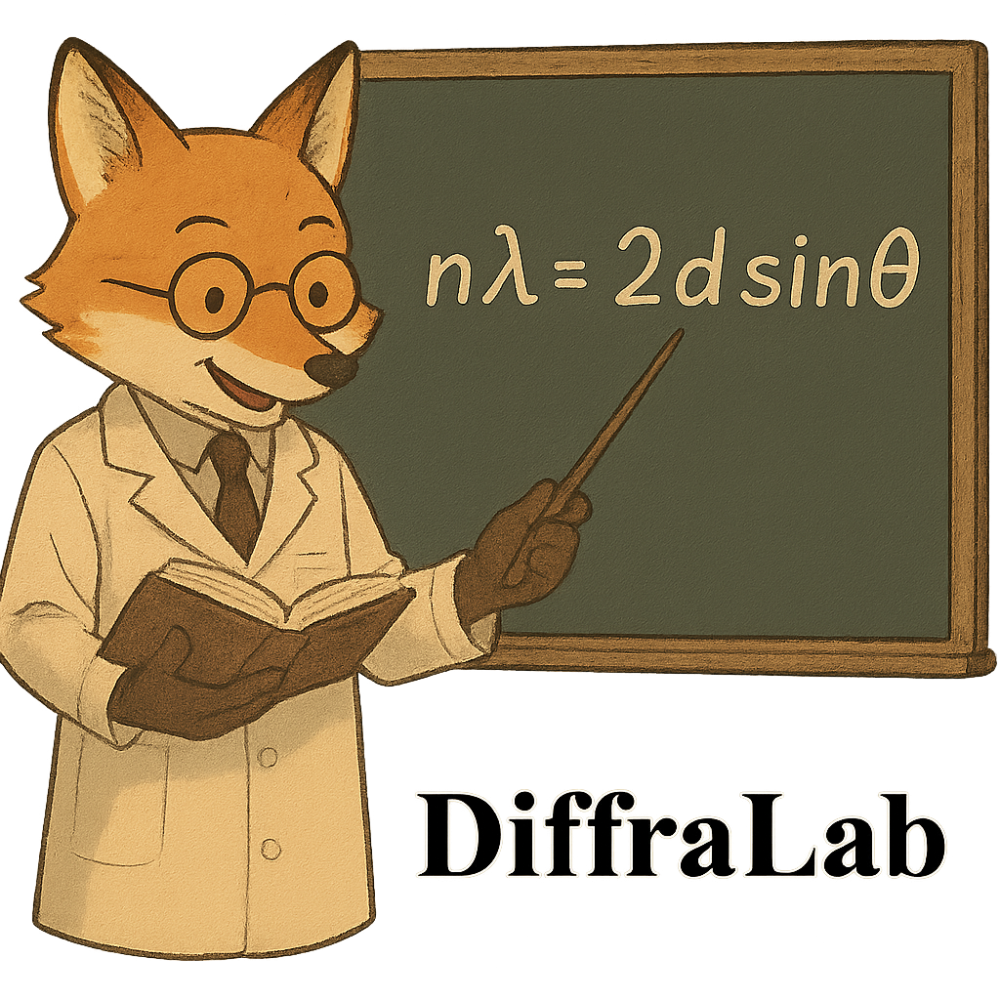
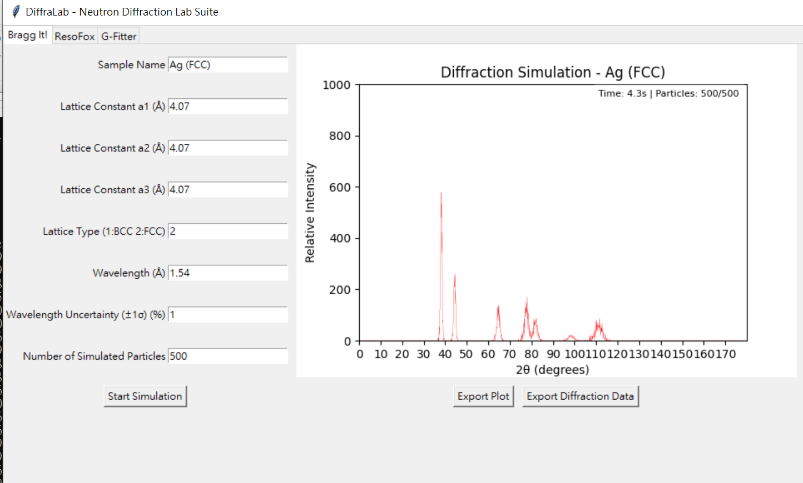
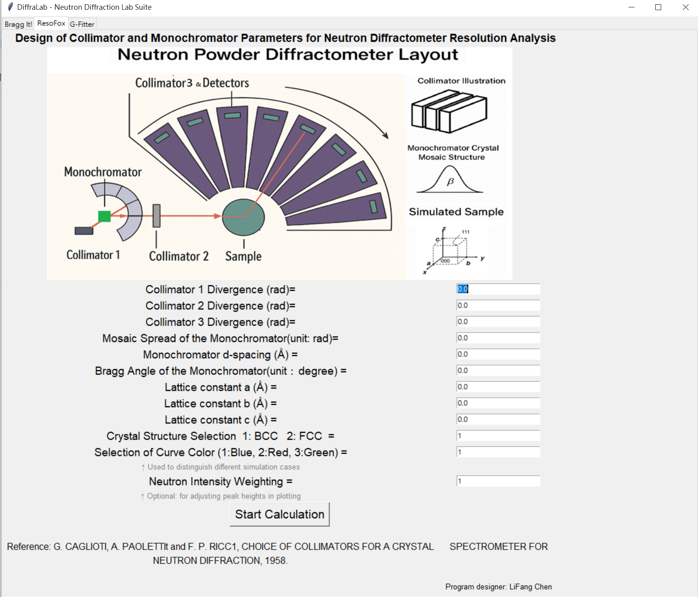
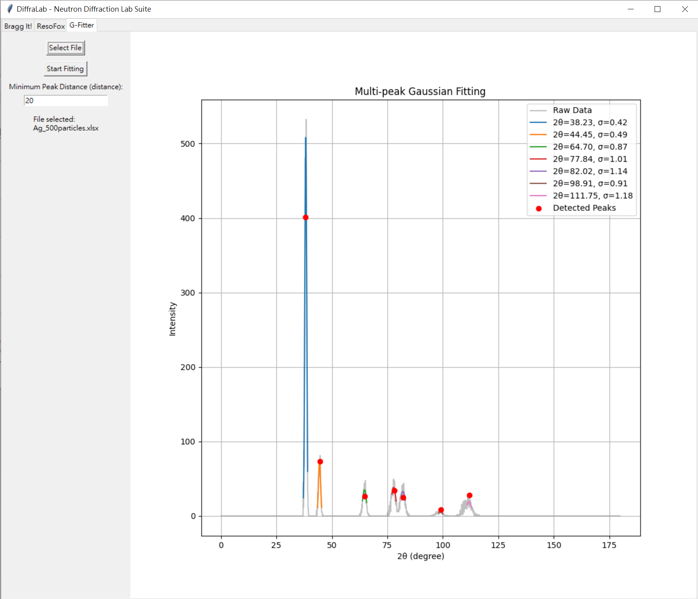

---

# DiffraLab


A Python educational platform (DiffraLab) integrating BraggIt (Monte Carlo powder diffraction), ResoFox (instrumental resolution calculator), and G-Fitter (multi-peak Gaussian fitting) for neutron and X-ray diffraction simulation and analysis in physics education.

---

## ✨ Features

✅ **BraggIt:** Simulate powder diffraction patterns for different crystal structures and wavelength uncertainties using Monte Carlo methods.  
✅ **ResoFox:** Calculate instrumental resolution functions of neutron diffractometers based on Caglioti’s analytical model.  
✅ **G-Fitter:** Perform multi-peak Gaussian fitting on experimental or simulated diffraction data, extracting FWHM and peak centers.  
✅ **GUI-based** for direct operation without programming background, suitable for classroom demonstration and lab training.  
✅ Developed for physics and materials science education.

---

## 🎯 Target Users

- Undergraduate and graduate students in Physics, Materials Science, or related fields.
- Courses including:
  - Solid State Physics
  - Modern Physics Laboratory
  - Diffraction and Instrumental Analysis

---

## 🚀 Installation

### Requirements
- Python 3.9+
- Recommended: Windows 10/11 or Linux

### Install and Run

```bash
git clone https://github.com/lifangchen2021/DiffraLab.git
cd DiffraLab

```
---

## 📂 Folder Structure
```
DiffraLab/
├── docs/           # Tutorial and supporting documents
│   ├── Tutorial_Exploring_Diffraction_and_Instrumental_Resolution_with_DiffraLab_V1.docx
│   ├── Tutorial_Exploring_Diffraction_and_Instrumental_Resolution_with_DiffraLab_V1.pdf
│   ├── DiffraLab 實作型教學設計手冊_V1.docx
│   ├── DiffraLab 實作型教學設計手冊_V1.pdf
│   └── DiffraLab_Diffraction_Simulation_Course_Likert_Scale_Questionnaire_En.docx
├── images/         # Mascot and GUI screenshots
│   ├── DiffraLab1.png
│   ├── BraggIt_demo.png
│   ├── ResoFox_demo.png
│   └── GFitter_demo.png
├── src/            # Main Python source files
│   ├── DiffraLab.py
│   ├── BraggIt.py
│   ├── ResoFox_v1_frame.py
│   ├── GFitter.py
│   └── main_png.py
├── LICENSE
├── README.md
└── requirements.txt
```
---
## 🖥️ Quick Usage and Demonstration

Below are brief operation steps with screenshots to help you get started quickly:

### 1️⃣ BraggIt - Powder Diffraction Simulation

- Simulates powder diffraction patterns with customizable lattice parameters and wavelengths.
- Utilizes **Monte Carlo methods to generate diffraction patterns for cubic crystal systems (e.g., FCC, BCC)**.
- Supports input of different particle numbers and calculation times, with **animated visualization of the diffraction pattern generation process**, helping students understand virtual experiments and diffraction statistics.
- **Enables export of diffraction plots and 2θ-intensity data in Excel format**, allowing students to calculate peak resolution and perform Gaussian fitting analysis.
- Visualizes diffraction peaks and relative intensities to facilitate learning of Bragg's Law and the principles of powder diffraction.



---

### 2️⃣ ResoFox - Instrumental Resolution Calculator

- Calculates the instrumental resolution function of neutron diffractometers based on the **Caglioti model**.
- Allows adjustment of collimator divergence and monochromator parameters to **visualize FWHM variations** under different conditions.
- **Supports exporting plots for comparison of results under different parameter settings**, helping students analyze how instrument configurations affect resolution.
- The console prints **detailed theoretical calculation data**, including relative neutron intensities, theoretical diffraction angles, FWHM, and resolution values for each setting, allowing in-depth analysis and validation.
- For a **more detailed tutorial and validation results**, please refer to the following repository: [https://github.com/lifangchen2021/ResoFox](https://github.com/lifangchen2021/ResoFox)



---

### 3️⃣ G-Fitter - Multi-peak Gaussian Fitting

- Performs **multi-peak Gaussian fitting on simulated or experimental diffraction data**.
- Extracts peak positions and FWHM values for analysis and reporting.
- By clicking the **"Select File" button**, users can select the Excel file exported from BraggIt and **directly perform Gaussian fitting on the simulated diffraction results**.




---
## 📘 Documentation
A complete tutorial is available:

📄 [Download: Exploring Diffraction and Instrumental Resolution with DiffraLab (pdf)](https://github.com/lifangchen2021/DiffraLab/blob/main/doc/Tutorial_Exploring_Diffraction_and_Instrumental_Resolution_with_DiffraLab_V1.pdf)

This tutorial guides instructors and students on using DiffraLab effectively in class or lab courses.

---
## 🚀 Download DiffraLab Executable

We provide a **Windows executable of DiffraLab** for instructors, students, and researchers interested in neutron diffraction, monochromator wavelength selection, and resolution simulation.

### 📥 Download

- [Download DiffraLab for Windows (DiffraLab.exe)](https://github.com/lifangchen2021/DiffaLab/releases/download/V1.0.0/DiffraLab.v1.0.0.exe)

If your browser blocks the download, please right-click the link and choose “Save link as” to download.

### ⚠️ Note

- You may see a Windows Defender or antivirus warning. If you downloaded the file directly from this repository, it is safe to allow execution.
- This software is provided for **educational and research purposes only**, not for commercial use.
- If you encounter issues or have suggestions, feel free to open an Issue or Pull Request in this repository.

For tutorials and usage instructions, please refer to the **Tutorial section described in the repository structure above**.

---
<!--
## 📝 Student Self-Learning Questionnaire

If you are a **student who downloads and uses DiffraLab for self-learning**, we invite you to fill out a short questionnaire to help us improve this tool and understand its impact in teaching and learning.

You can access the questionnaire here:


- [DiffraLab Student Self-Learning Questionnaire](https://github.com/lifangchen2021/DiffraLab/blob/main/doc/DiffraLab_Diffraction_Simulation_Course_Likert_Scale_Questionnaire_En.docx)


We would greatly appreciate it if you could share your feedback with us by submitting the questionnaire after you complete your learning activity using DiffraLab.

Your responses will help us improve future versions of DiffraLab and support our educational research.

If you prefer, you can also email your completed questionnaire or feedback to us at:

📧 lifangchen0507@gmail.com

Your responses will help us improve future versions of DiffraLab and support our educational research.
-->
---

## 📝 Citation
If you use DiffraLab in your teaching, publication, or project, please cite:

Chen, L. F., & Chen, Y.-L. (2025). DiffraLab: An Interactive Simulation Platform for Exploring Neutron and X-ray Diffraction Principles in Undergraduate Education. GitHub. https://github.com/lifangchen2021/DiffraLab

---

## 📜 License
This project is licensed under the **Creative Commons Attribution-NonCommercial 4.0 International (CC BY-NC 4.0)**.

This means you are free to:
- **Share** — copy and redistribute the material in any medium or format
- **Adapt** — remix, transform, and build upon the material

Under the following terms:
- **Attribution** — You must give appropriate credit.
- **NonCommercial** — You may not use the material for commercial purposes.

For more details, please see the [license details here](https://creativecommons.org/licenses/by-nc/4.0/).

---
## Author & Contact
**Ms. Li-Fang Chen**  
Science Teaching Materials Development  
📧 Email: lifangchen0507@gmail.com  
🔬 ORCID:  [https://orcid.org/0009-0007-0352-735X](https://orcid.org/0009-0007-0352-735X)

**Dr. Yu-Lim Chen**  
Science Education Methodology Research & Gifted Education   
🌐 Website:  https://scholar.lib.ntnu.edu.tw/en/persons/yu-lim-chen-2  
📧 Email:  chendaneyl@ntnu.edu.tw  
🔬 ORCID:  https://orcid.org/0000-0003-3128-8759  

---

## 🤝 Contributions
Contributions to extend the tool, add educational modules, or support additional diffraction analysis are welcome. Please open an issue or pull request if you wish to contribute.

---

## ❤️ Acknowledgment
Developed to support physics and materials science education, helping students visually understand diffraction and instrumental resolution.

---


